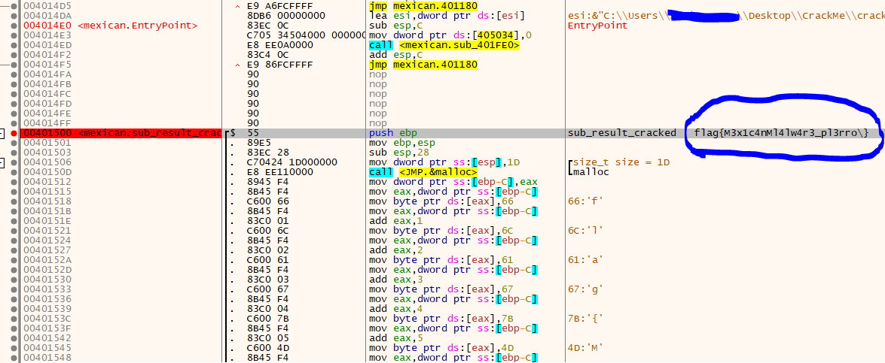

# [evilprogrammer's mexican](https://crackmes.one/crackme/5d63011533c5d46f00e2c305)
### https://crackmes.one/crackme/5d63011533c5d46f00e2c305

## Crackme by [b1h0](https://crackmes.one/user/b1h0) https://crackmes.one/user/b1h0
#### Date: 19/sep/2019 

- Used **x64dbg** debugger.  

#### Some notes to get the flag and create the patch

- Once the **EntryPoint** is located, you can verify that at the address **0x00401500** a subroutine begins, which is the one shown in the *flag* text. We will call this subroutine: **sub_result_cracked**

- Then later we can find in the address **0x004013dd** a call to the address **0x0040162c** which is the subroutine that we will call **sub_compare_crackme**. We establish a breakpoint there and then continue step by step.

- Finally at address **0x00401642** we find a comparison of the value **0xC1** with the value 0xC1. The key is that the two values have to be different, and in particular the first one greater than the second, therefore we change the first 0xC1 for a greater value, or the second 0xC1 for a smaller value.

- So we change the *0xC1* value of the comparison line to a lower value. For example, **0 (zero)**

#### The flag

- After the change, the flag message appears. Printed message: **flag{M3x1c4nMl4lw4r3_pl3rro}**

Note one curious thing. After displaying the flag, strange or random characters are still displayed. This is because the flag string does not end with **NULL '\0'**. It is likely that there is some part of the code that adds this value to the chain or it could also be that the programmer has forgotten this detail.

#### The Patch

The file for the patch is included with the name mexican-patch.1337

	>mexican.exe
	00001642:81->83
	00001646:C1->00
	00001647:00->90
	00001648:00->90
	00001649:00->90

