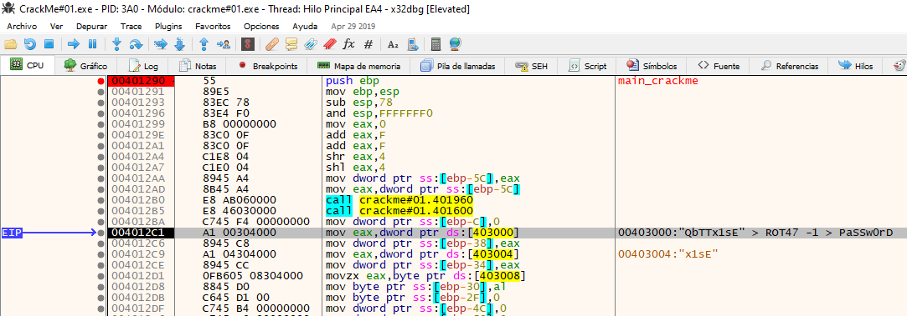
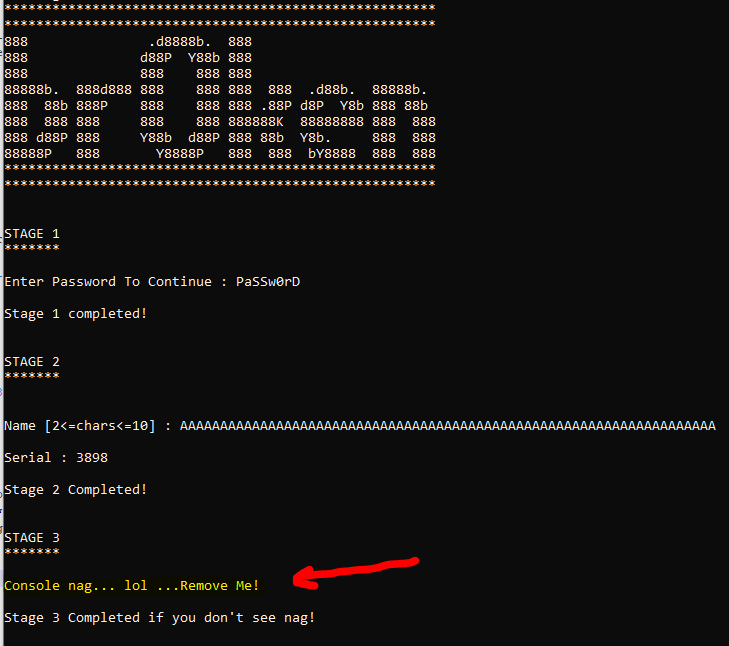
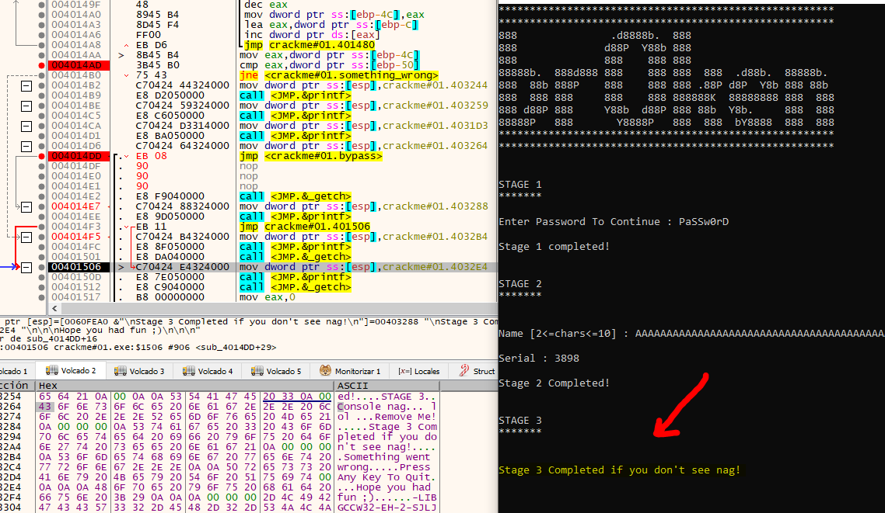

# [CrackMe#01](#no_source_available)
#### I do not have a source site for downloading this crackme because I do not remember how it came to me. Probably in one of these many searches I did online.

## Crackme by [b1h0](https://crackmes.one/user/b1h0) https://crackmes.one/user/b1h0
#### Date: 29/mar/2020 

You can download **CrackMe#01.exe** from this [link](CrackMe%2301.zip).

To analyze this file I have used **Ghidra** and **x64dbg**, simply by trying both tools and seeing the differences. It is good to contrast and train in both static and dynamic.
 
## Ghidra analysis

When analyzing the code of **main()** function we see that the challenge is separated into 3 stages.

In the first stage we are asked for a Password. Once entered, we see that a loop is executed that increments each character in the string by 1.
Therefore the string that will give us the solution in this first section is stored in memory with ROT + 1
 
 
 
In the second stage it asks for a Name and a Serial Number. The serial number appears to be derived from the sum of ASCII values decremented by 1 of each character in the name.

In the third stage, the user is asked to delete the message that appears, and that is when the three levels have been passed.

### main() function 

	int __cdecl _main(int _Argc,char **_Argv,char **_Env)

	{
	  size_t i_pass_len;
	  int i_pass_no_ok;
	  size_t local_80;
	  int i_serial_input;
	  int i_good_serial;
	  char s_name_input [16];
	  undefined4 ps_good_password;
	  undefined4 local_38;
	  undefined local_34;
	  undefined local_33;
	  char s_pass_input [28];
	  uint i_counter;
	  
	  __alloca(local_80);
	  ___main();
	  i_counter = 0;
	  ps_good_password = 0x54546251;
	  local_38 = 0x45733178;
	  local_34 = 0;
	  local_33 = 0;
	  i_good_serial = 0;
	  i_serial_input = 0;
	  _printf("******************************************************\n");
	  _printf("******************************************************\n");
	  _printf("888               .d8888b.  888\n");
	  _printf("888              d88P  Y88b 888\n");
	  _printf("888              888    888 888\n");
	  _printf("88888b.  888d888 888    888 888  888  .d88b.  88888b.\n");
	  _printf("888  88b 888P    888    888 888 .88P d8P  Y8b 888 88b\n");
	  _printf("888  888 888     888    888 888888K  88888888 888  888\n");
	  _printf("888 d88P 888     Y88b  d88P 888 88b  Y8b.     888  888\n");
	  _printf("88888P   888       Y8888P   888  888  bY8888  888  888\n");
	  _printf("******************************************************\n");
	  _printf("******************************************************\n");
	  _printf("\n\nSTAGE 1\n");
	  _printf("*******\n\n");
	  _printf("Enter Password To Continue : ");
	  _scanf("%s",s_pass_input);
	  i_pass_len = _strlen(s_pass_input);
	  if (i_pass_len == 8) {
		i_counter = 0;
		while ((int)i_counter < 8
						/* Loop that increments each character in the string by 1.
						   Therefore the string is stored in memory with ROT + 1 */) {
		  s_pass_input[i_counter] = s_pass_input[i_counter] + '\x01';
		  i_counter = i_counter + 1;
		}
		i_pass_no_ok = _strcmp(s_pass_input,(char *)&ps_good_password);
		if (i_pass_no_ok == 0) {
		  _printf("\nStage 1 completed!");
		  _printf("\n\n\nSTAGE 2\n");
		  _printf("*******\n\n");
		  _printf("\nName [2<=chars<=10] : ");
		  _scanf("%s",s_name_input);
		  _printf("\nSerial : ");
		  _scanf("%d",&i_serial_input);
		  i_counter = 0;
		  while (i_pass_len = _strlen(s_name_input), i_counter <= i_pass_len) {
			i_good_serial = s_name_input[i_counter] + i_good_serial + -1;
			i_counter = i_counter + 1;
		  }
		  if (i_good_serial == i_serial_input) {
			_printf("\nStage 2 Completed!\n");
			_printf("\n\nSTAGE 3\n");
			_printf("*******\n\n");
			_printf("Console nag... lol ...Remove Me!\n");
			_getch();
			_printf("\nStage 3 Completed if you don\'t see nag!\n");
			goto LAB_00401506;
		  }
		}
	  }
	  _printf("\nSomething went wrong...\n\nPress Any Key To Quit");
	  _getch();
	LAB_00401506:
	  _printf("\n\n\nHope you had fun ;)\n\n\n");
	  _getch();
	  return 0;
	}

## x64dbg analysis

### STAGE 1

At the beginning of the main () function you can check how a pointer to a string is loaded in memory with the string **"QbTTx1sE"** to which, if we apply the ASCII -1 rotation, we get the string **"PaSSw0rD"**.

 
 
 
 

### STAGE 2

Here a Name and a Serial Number are requested.
The serial number is generated from the sum of the ASCII values of each letter, minus 1, and for the end of string character it subtracts again 1. Thus the string "AA" where each "A" has the value 41 hex we have 40 hex = 64 dec the sum would be 128 dec but we have to subtract 1 from the **NULL** at end of the string, so the Serial number corresponding to the name "AA" is 127 dec.

 

	AA = 127
	AAAAAAAAAAAAAAAAAAAAAAAAAAAAAAAA = 2047
	AAAAAAAAAAAAAAAAAAAAAAAAAAAAAAAAAAAAAAAAAAAAAAAAAAAAAAAAAAAAAAAAAAA = 3898

I did different tests with different lengths, to see if it affected the following scenario, but I only managed to cause an **overflow** (the maximum length of the name is not controlled) and that the program break and not continue.

 

### STAGE 3

In the third scenario it is about removing an annoying message. The only option I have been able to find is to bypass this message by jumping to the next message just where the **printf()** function is called. 

 

 

My intention was to find another method that does not imply modifying the code but I have not been able to find it.

 

So, changing the code in the middle of the debugging we force a jump to avoid showing the message and complete this third stage.

 

# That's all folks!

