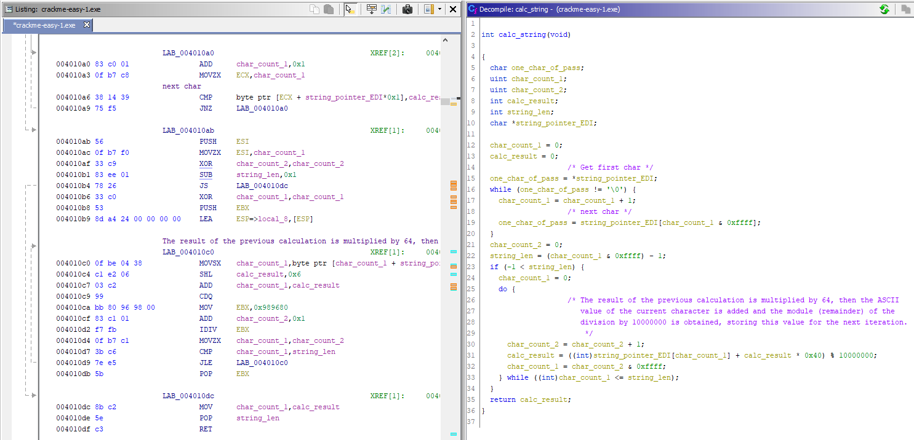
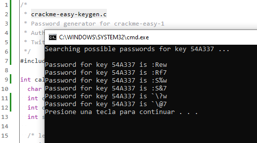
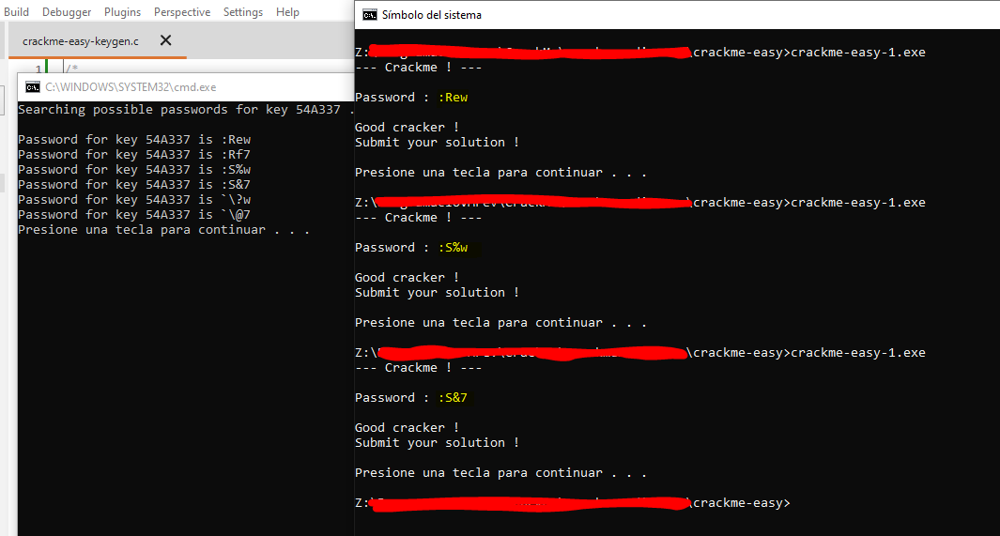

# [crackme-easy-1](#no_source_available)
#### I do not have a source site for downloading this crackme because I do not remember how it came to me. Probably in one of these many searches I did online.

## Crackme writeup by [@H0l3Bl4ck](https://twitter.com/H0l3Bl4ck) https://twitter.com/H0l3Bl4ck
#### Date: 02/apr/2020 

[Download **crackme-easy-1** from this link](crackme-easy-1.zip). 

I am going to solve this crackme using only static analysis and I am also going to generate a small program to give us the solution to the password we need.

## Ghidra analysis

After doing a first analysis we see that the code simply asks us for a password and that to check if it is correct it does a encrypt of our string and finally make a comparison with a encrypted value.

The code generated in C has been analyzed replacing the different variables with understandable names to better understand the code and what it is doing.

The string is encrypted by storing the sum of the ASCII values of each digit in memory. For each new digit the previous value is multiplied by 64, then the ASCII value of the current character is added and the module (remainder) of the division is obtained by 10000000, storing this value for the next iteration.

 

So, in this example, we simulate that the password entered is **"ABCD"** and we reproduce step by step the calculations made until we reach the encrypted password that gives us the value **"6F9A84"**.

The step-by-step calculation process would be as follows:
	
	ABCD = 006F9A84

	A = 41 => (65 + 0 * 64) % 10000000 = 65
	B = 42 => (66 + 65 * 64) % 10000000 = 4226  
	C = 43 => (67 + 4226 * 64) % 10000000 = 270531
	D = 44 => (68 + 270531 * 64) % 10000000 = 7314052 dec = 6F9A84
	
We can summarize it in the following image.

***NOTE***: It is possible that in some section of the writing it refers to encryption of the text string but technically it **is not an encryption**, it is simply a calculation to obtain a hexadecimal value. In fact the reverse step I have not been able to do it because data is lost when obtaining the module of the division.

As we can see in the **main()** function, the process is very simple. It asks us for a password, calls the calc function and then compares it with the value **0x54a337**, so we know that this is the value that we have to obtain by trying to reverse the calc function.

At this point, we can deduce that the password is likely to have a length of 4 digits for the value reached, and that the reverse operation is impossible. Or at least, I think so.

So we only have to simulate a brute force process to obtain the password by creating a program that calls the function repeatedly until the correct value is found.

Due to this, it is possible that there are different passwords that give us the same encrypted key that the program expects. So our brute force program will generate all the possible passwords for us.

The program is as follows, starting from the decompiled function with Ghidra.

	#include <stdio.h>

	int calc_string(char *string_pointer) {
	  char current_char;
	  int char_count;
	  int calc_result;
	  int string_len;
	  
	  /* length of string */
	  string_len = 0;
	  calc_result = 0;
	  current_char = *string_pointer;
	  while (current_char != '\0') {
		string_len++;
		current_char = string_pointer[string_len];
	  }
	  
	  /* calc string */
	  string_len--;
	  if (-1 < string_len) {
		char_count = 0;
		do {
			/* The result of the previous calculation is multiplied by 64, then the ASCII
			   value of the current character is added and the module (remainder) of the
			   division by 10000000 is obtained, storing this value for the next iteration.
			*/
			calc_result = ((int)string_pointer[char_count] + calc_result * 0x40) % 10000000;
			char_count++;
		} while ((int)char_count <= string_len);
	  }
	  return calc_result;
	}

	int main(int argc, char **argv)
	{
		int key = 0x54a337;
		int calc_key;
		char c1, c2, c3, c4, first, last;
		char pass[5];
		 
		pass[4] = '\0';
		printf("Searching possible passwords for key %X ...\n\n", key);
		first = '!';
		last = '}';
		   
		for (c1 = first; c1 <= last; c1++) {
			for (c2 = first; c2 <= last; c2++) {
				for (c3 = first; c3 <= last; c3++) {
					for (c4 = first; c4 <= last; c4++) {
						pass[0] = c1;
						pass[1] = c2;
						pass[2] = c3;
						pass[3] = c4;
						calc_key = calc_string(pass);
						if ( calc_key == key ) {
							printf("Password for key %X is %s \n", calc_key, pass);
						}
					}
				}
			}
		}
		return 0;
	}

[Download binary and source of **crackme-easy-keygen.c**](crackme-easy-keygen.zip).

And here we have the list of different Passwords that give us the solution.

Let's check it...

Indeed, they work !!!

# That's all folks!

