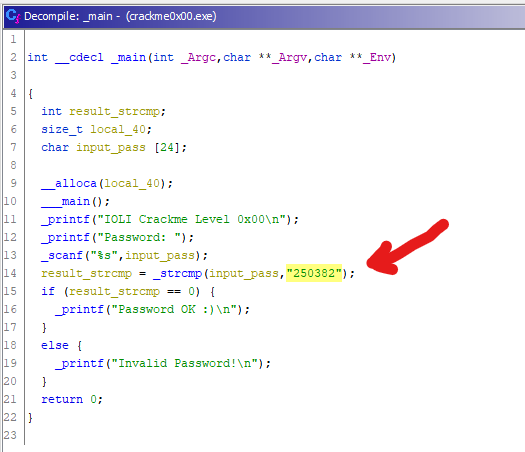
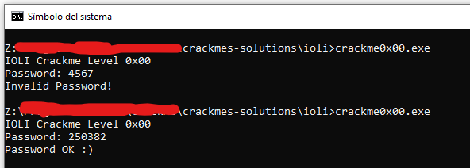

# [IOLI crackme0x00](crackme0x00.exe) 

## Crackme writeup by [@H0l3Bl4ck](https://twitter.com/H0l3Bl4ck) https://twitter.com/H0l3Bl4ck
#### Date: 06/abr/2020 

You can download **crackme0x00.exe** from this [link](crackme0x00.exe). 

We have here a simple executable that asks us for a password. Let's see how we discovered it.

 

To analyze this file I have used only static analysis with **Ghidra**.

## Ghidra analysis

If we place ourselves in the **main()** function with Ghidra, we can quickly see after asking for the password, that a value is loaded in the stack with a text string, and then another value with the memory address where the password has already been entered, then the **_strcmp()** function is called. The first value loaded as a parameter is precisely the password we are looking for, which corresponds to the text string **"250382"**.

 

If we look for this reference in memory we will quickly see the string with the password.

 

This is more evident even if we access the Decompiler tab where the code in C clearly reveals the comparison with that text string. So this crackme is solved simply. 

Let's see the result.

# That's all folks!

