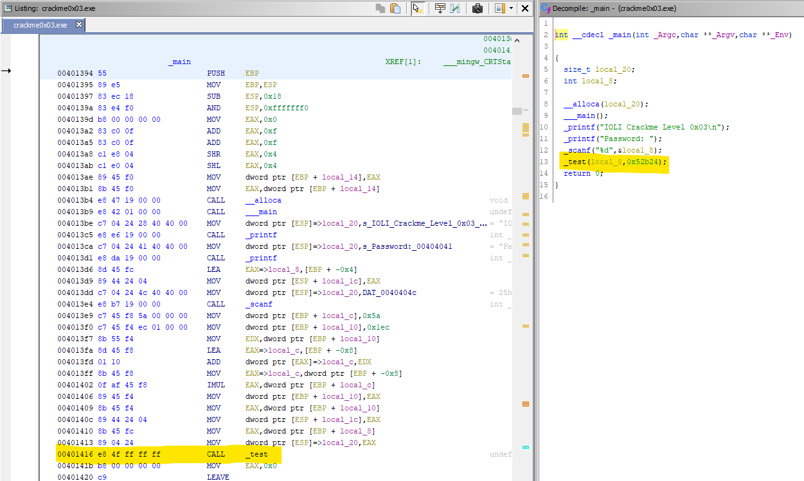
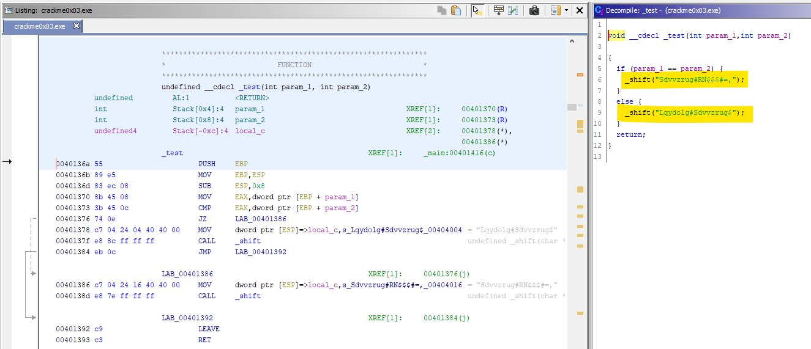
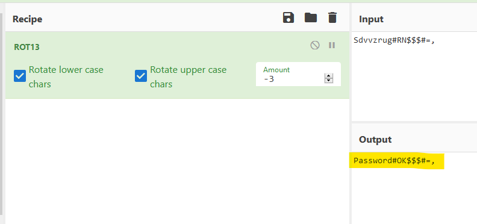
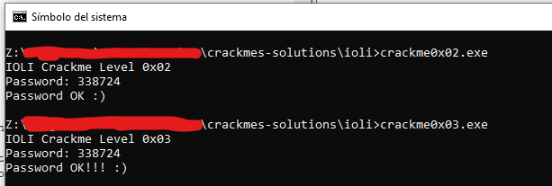

# [IOLI crackme0x03](crackme0x03.exe) 

## Crackme writeup by [@310hkc41b](https://twitter.com/310hkc41b) https://twitter.com/310hkc41b
#### Date: 07/abr/2020 

You can download **crackme0x03.exe** from this [link](crackme0x03.exe). 

To solve this cackme we will only use static analysis.

## Ghidra analysis

**WTF** When looking at the code I am surprised, it is practically the same !!! 

 

But no! it is not exactly the same. If we can see that the operations are the same, so the password is also the same as the previous crackme, that is **338724**, but there is a difference. Password checking is done within a function. A merely anecdotal and irrelevant fact to find the solution, but that we will also look to confirm what we see.

 

Here we can check that the **_test()** function does the expected comparison, but calls another function called **_shift()** with a text string that we can clearly see is obfuscated or encrypted.

Analyzing the **_shift()** function (after giving understandable names to variables) we can clearly see that what is done is a simple translation of ASCII codes for each of the characters, in this case subtracting a value of **3** to each character to obtain the resulting string, which is simply the message that indicates whether we have password is correct or not.

 

If we apply the rotation function we can quickly see the message that will be displayed. Note that some characters such as the "#" have not been rotated in this image, which would result in a blank space.

 

And after the anecdotal example of the final message, we go to check if the password is the same.

 

As we can see, in this case we will not need to do any dynamic analysis.

# That's all folks!

