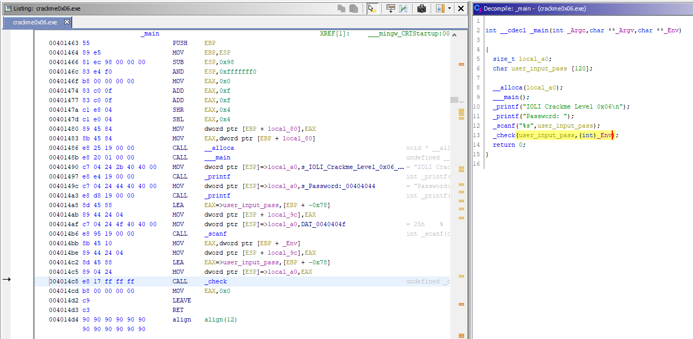
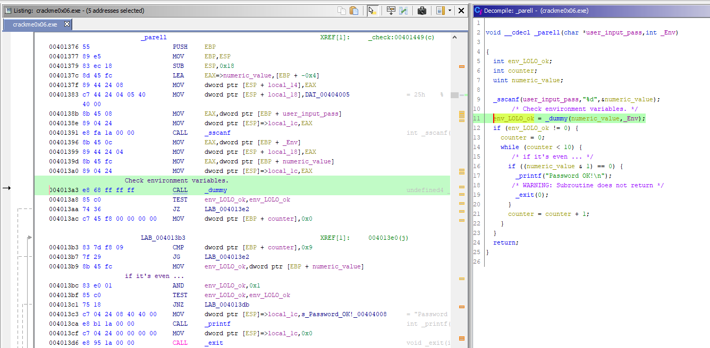
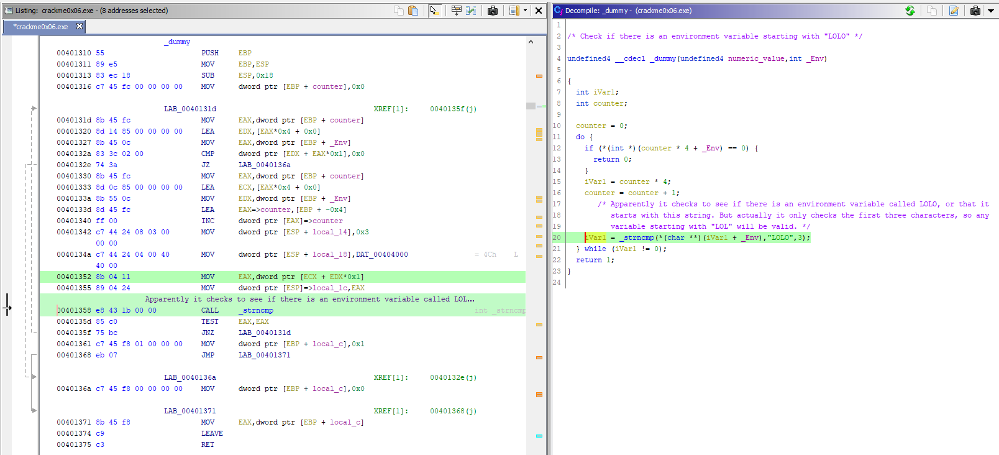
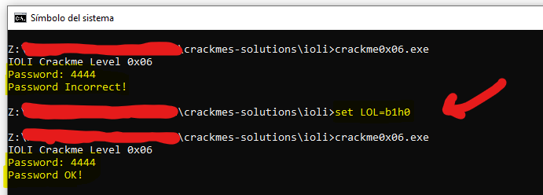

# [IOLI crackme0x06](crackme0x06.exe) 

## Crackme writeup by [@H0l3Bl4ck](https://twitter.com/H0l3Bl4ck) https://twitter.com/H0l3Bl4ck
#### Date: 07/abr/2020 

You can download **crackme0x06.exe** from this [link](crackme0x06.exe). 

To solve this cackme we will only use static analysis.

## Ghidra analysis

In this case, we have another new feature in the **_main()** function that also affects the **_check()** function. 

 

Let's see what the **_check()** function does with this new variable.

 

So far, apparently, it does the same checks as the previous crackme.

The sum of the digits has to be **0x10**, that is, **16 decimal**.

When this sum is fulfilled, another function **_parell()** is called that makes a new check on the entered password. But now, in addition, it passes environment variables to do a new check. Let's see ...

 

Now, before checking if the value is odd or even, do an additional check with the **_dummy()** function that checks the environment variables (we'll see below). If the expected environment variable is found to exist, the following check is made to see if it is even and then reports that the password is correct.

Interestingly, this check is inside a loop to run 10 times if it is odd. I am not sure if it is a programmer error, or it is made to mislead the analysis.

Let's see what the **_dummy()** function does ...

 

Apparently it checks to see if there is an environment variable called **LOLO**, or that it starts with this string. But actually it only checks the first three characters, so any variable starting with **"LOL"** will be valid.

Let's check all this ...

 

# That's all folks!

