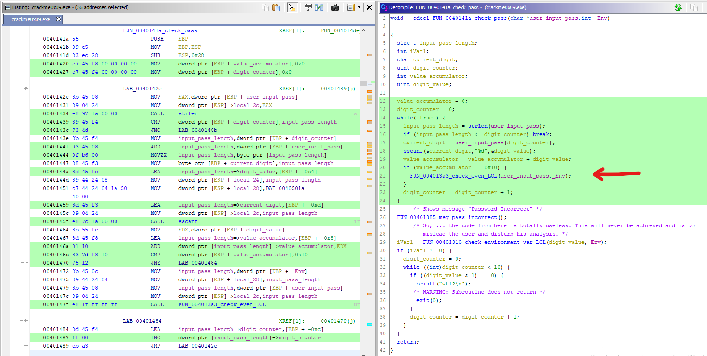
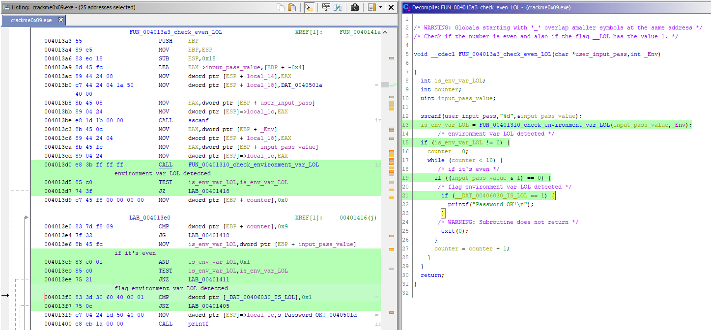
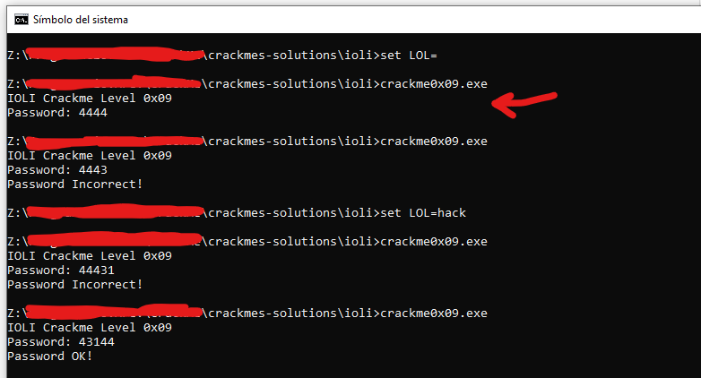

# [IOLI crackme0x09](crackme0x09.exe) 

## Crackme writeup by [@H0l3Bl4ck](https://twitter.com/H0l3Bl4ck) https://twitter.com/H0l3Bl4ck
#### Date: 09/abr/2020 

You can download **crackme0x09.exe** from this [link](crackme0x09.exe). 

To solve this cackme we will only use static analysis.

## Ghidra analysis

We find again in this crackme the lack of the **_main()** function and this is because it has been compiled without the symbol names.

 

If we follow the call to the function **FUN_00401140()** we will get to another part of the code where several irrelevant system initializations are made and below, just before the exit of the program, there is a call to the function **FUN_004014de()**. I rename it and add the suffix **_main()** to make it look clearer.

 

Entering this **main()** function we see the structure similar to the previous cases. The only difference is that the names are not the proper functions, but analyzing the code we can deduce what each function does and we are renaming them.

So, the function that is called after asking for the password will add the suffix **check_pass**.

 

Within the **check_pass()** function we will focus on the part of the code highlighted in green. There we have the password check, and right where the red arrow is the first condition, the same as the previous ones, that the sum of the digits is **0x10** (16dec) and it continues doing other checks in the function **check_even_LOL()**.

All that is below does not interest us, it is the message that the password is incorrect, and then there is code that is only set to annoy or mislead.

 

Next we have the **check_even_LOL()** function, which the first thing it does is check if there is an environment variable that begins with **"LOL"** and returns the result on a variable and also sets a flag on a memory location. Just like in previous crackmes, it is simply a double security check.

Then see if the password entered is an even number, and if all the conditions are met, the message **"Password OK"** is displayed.

 

And here we have the function that checks the environment variables and the setting of the control flag.

 

There is a curious situation that the programmer may not have taken into account, and that is that if the environment variable LOL does not exist, if the password is correct, **no "Password Incorrect"** message is displayed, which theoretically if it should appear.

As we can see, the conditions for passwords are the same.

 

# That's all folks!

